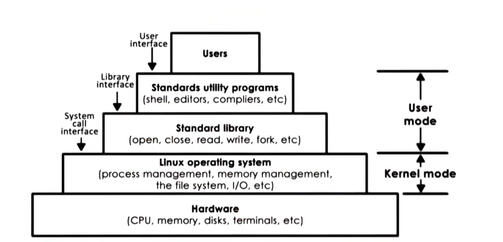
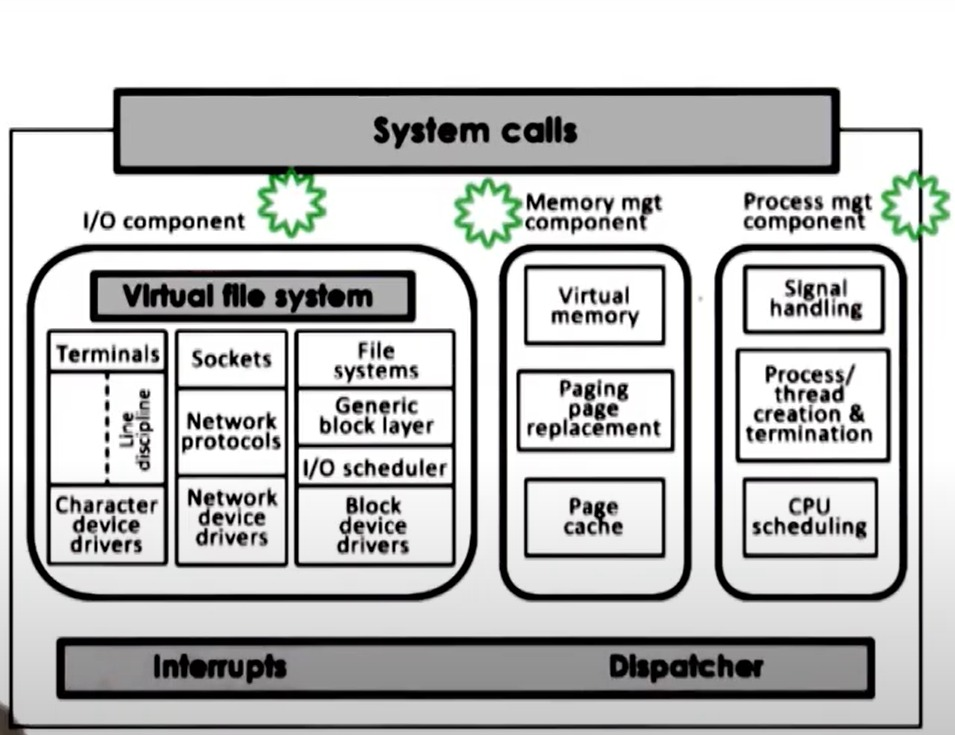
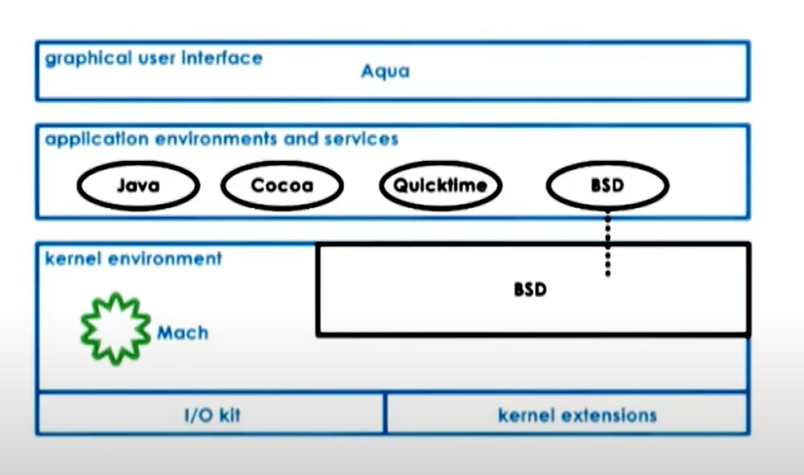

# 01 - Introduction to Operating Systems

- [1. Definition of Operating Systems](#1-definition-of-operating-systems)
- [2. Roles of Operating System](#2-roles-of-operating-system)
  - [2.1. Simplifying the Complex Hardware](#21-simplifying-the-complex-hardware)
  - [2.2. Resource Management](#22-resource-management)
  - [2.3. Isolation and Protection](#23-isolation-and-protection)
  - [ADDITIONAL NOTE: Abstraction and Arbitration](#additional-note-abstraction-and-arbitration)
- [3. Elements of Operating System](#3-elements-of-operating-system)
  - [Example: Memory Management](#example-memory-management)
- [4. Operating System Design Principles](#4-operating-system-design-principles)
  - [4.1. Separation of Mechanism and Policy](#41-separation-of-mechanism-and-policy)
  - [4.2. Optimization of the Common Case](#42-optimization-of-the-common-case)
- [5. Operating System User/Kernel Protection Boundary](#5-operating-system-userkernel-protection-boundary)
- [6. System Call Flowchart](#6-system-call-flowchart)
- [7. Operating Systems Services](#7-operating-systems-services)
- [8. Different Types of Operating System Organization](#8-different-types-of-operating-system-organization)
  - [8.1. Monolithic Operating System](#81-monolithic-operating-system)
  - [8.2. Modular Operating Systems](#82-modular-operating-systems)
  - [8.3. Micro-Kernel](#83-micro-kernel)
- [9. Linux Architecture](#9-linux-architecture)
- [10. Linux Architecture](#10-linux-architecture)

## 1. Definition of Operating Systems

An **operating system** is the layer of system software between the applications - that run on a computing system, and the complex hardware of this system. Some of the well-knows operating systems are Apple macOS, Microsoft Windows, Google's Android OS, Linux Operating System, and Apple iOS.

The hardware that the operating system responsible to manage includes:
* multi-core CPUs
* Ethernet/WiFi card
* USB ports
* GPU
* Memory

## 2. Roles of Operating System

### 2.1. Simplifying the Complex Hardware

It separates the application from dealing with the low-level details of the hardawre by providing high-level abstractions and services to simplify the view of the hardware according to some predefined policies so that the application can use them directly. For example:

* Storage: The OS hides the complexity of various types of the storage devices such as the RAM, Flash, USB ports.
* Files: The OS manages a high level of the file management system as it provides services for reading and writing on files.
* Web Server: The OS makes the web applications don't need to think of the details of composing the data packets as it provides a **socket** abstraction for sending and recieving the data packets from the internet.

### 2.2. Resource Management

The OS decides how many and which resources an application will use. For example:

* Memory: The OS is responsible for allocating of the memory that the application will use during its working time.
* CPU: The OS is responsible for the scheduling of the multiple applications on the CPU that can execute them.

### 2.3. Isolation and Protection

When multiple applications are running in the same time, the OS must ensure that each of these applications can make adequate progress and that they don't affect each other. For example, The OS will allocate different segments of memory - and other resources - for each application but one application can't access or modify the memory segments of another application.

### ADDITIONAL NOTE: Abstraction and Arbitration

The OS **abstracts** and **arbitrates** the use of computer system. An abstraction is that the OS simplify the underlying hardware through some kind of services to the applications. While an arbitration is the way that the OS itself manages the underlying hardware.

## 3. Elements of Operating System

An operating system supports a number of higher-level **abstractions**, and a number of key **mechanisms** that operate on top of these abstractions.

For example, some of these abstractions like *process*, *thread* correspond to the applications the OS executes. The corresponding mechanisms for them can be to *create* one to start executing, or to *schedule* it to actually run on the CPU.

Other abstractions like *file*, *socket*, and *memory page* correspond to the hardware resources that the OS needs to manage like the disk, or the network card, or the memory (RAM) itself. Some corresponding mechanisms are to *open* a particular device or a hardware component, to *write* to it, or to *allocate* a resource.

Operating sytsems may also integrate specific **policies** that determine how the mechanisms will be used to manage the hardware resources. For example, what is the maximum number of the sockets may be used by a process?, which data should be removed from the physical memory according to the least-recently used *(LRU)* or the earliest-deadline first (EDF) policies. 

To sum up:

* Abstractions
  * process, thread, file, socket, memory page
* Mechanisms
  * create, schedule, open, write, allocate
* Policies
  * least-recently used (LRU), earliest-deadline first (EDF)

### Example: Memory Management

In memory management, the most common abstraction is a *memory page*, which is an addressable region of memory of a fixed size, e.g., 4k. The corresponding mechanisms may be to *allocate* that page in the D-RAM. It can *map* that page into the address of a process allowing the process to access the physical resource provided by the memory page.

A policy may be used to determine if a content will be stored physcially in the DRAM, Disk or other resources. A common one is the *LRU* which decides that pages that have been least recently used over a period of time are the ones that will be no longer in the physical memory and instead will be copied on disk.

## 4. Operating System Design Principles

### 4.1. Separation of Mechanism and Policy

A mechanism should be flexible to integrate with different policies. A mechanism to integrate with policies like LRU, least-frequently used (LFU), or random should have a kind of tracking system to track the frequency or the time the resources were accessed.

### 4.2. Optimization of the Common Case

A number of questions must be taken into consideration in order to understand what the common case is. For example:

* What kind of machine(s) the OS will be used?
* What will the user want to execute on this machine?
* What are the workload requirements?

Based on the common case derived from questions like these, we should choose a specific policy that makes sense given the abstractions and mechanisms supported by the OS.

## 5. Operating System User/Kernel Protection Boundary

Computer platforms distinguish between two modes/levels; **unprivileged user-level mode** and **privileged kernel-level mode**. The operating system must have direct access to the hardware of that platform, it must operate in kernel-level from which hardware access can only be done while applications run in user-level.

Crossing from these two modes in both ways is supported by the hardware. If an application, that performs in the unprivileged mode, attempts to perform a privileged operation, this will cause a **trap**. The application will be interrupted, and the hardware will switch control to the OS which will check what caused that trap to occur and if it should grant it that access or terminate the proccess if it was performing that illegal action.

The interaction between the applciations and the operation system, which in turn interacts with the physical hardware, can be done through **system call** interface. The system call interface is a set of operations that the applications can explicitly invoke if they want the operating system to perform a certain service (privileged operation). For example: **open** (file), **send** (socket), and **mmap** (memory).

The operating system also supports **signals**. A signal is a mechanism for the operating system to pass notifications to the applications.

## 6. System Call Flowchart

The executing process call a system call because it needs some hardware access. During system call, the control is passed to the operating system which is in privilege kernel-level mode. The operating system will perform the operation and return the results to the process.

Executing the system call involves changing the execution content from the user process to the operating system kernel and passing arguments and then jumping in memory of the kernel so that you can go through the instruction sequence that correspond to the system call.

Once the system call is complete, it returns the result and the control back to the user process. In addition, it will change the execution of the context from the the operating system kernel to the user process, in which is inverted to the unprivileged user-mode, passing any arguments back into the process and jumping back into the exact same location where the system call was made from as this operation is *synchronus*.

To make a system call, an application must:

* write arguments
* save relevant data at well-defined location
* make the system call

These arguments can either be passed **directly** between the user and the operating system or **indirectly** by specifying their address.

## 7. Operating Systems Services

The operating systems exports low-level basic services that are directly linked to some hardware components. For example:

* Scheduler: responsible for controlling the access of the CPU(s).
* Memory Manager: responsible for allocation the underlying physical memory and ensuring that multiple applications don't overwrite each other's access to memory.
* Block Device Driver: responsible for access a block device like the disk.

In addition, the operating system also supports a set of high-level services that are linked with higher-level abstractions as opposed to those low-level services mapped directly to the hardware. For example, file system.

In summary, the operating system will have to incorporate a number of services to provide applications and developers with a number of useful types of functionality. The operating system makes these services available via ***system calls***.

## 8. Different Types of Operating System Organization

### 8.1. Monolithic Operating System

Historically, the operating system were following the monolithic design in which **every possible service** that any one of the applications or the hardware resources can require is already part of the operating system. For example, you will find in a monolithic operating system a **file system for sequential R/W access** and **file system optimized for random I/O**

 **Pros:** 

* everything (i.e., every needed service) included
* all services are packaged and compiled 

 **Cons:** 

* bad portability
* hard to maintain, debug, or upgrade
* requires large memory and resources requirements which impacts the performance of the applications run on top of it

### 8.2. Modular Operating Systems

This is the more common approach used when select an organization for the operating system like the Linux OS.

It has a number of basic services but more services can be added or customized as  **modules:** . For example, you can easily customize which particular file system or scheduler the operating system uses. This can be done because the modular operating system secifies certain interfaces that any module must implement in order to be part of that operating system.

 **Pros:** 

* easy to maintain, debug, and upgrade
* smaller codebase size (footprint)
* less resource needs increasing the performance of the applications

 **Cons:** 

* Indirection, i.e., going through the interface of the module then go to the actual implementation of the service, may impact optimization and performance but not very significant

### 8.3. Micro-Kernel

Micro-kernels only require the most basic primitives at the operating system level. At that level, a micro-kernel supports some basic services such as representing an executing application, its address space, and its context.

All other software components like file systems, and disk driver or applications like databases will run on the unprivileged user-level. For that, the micro-kernel requires a lot of inter-process interactions. So, a micro-kernel contains inter-process communicaitons **(IPC)** as one of its core abstractions and mechanisms along address spaces, thread, etc.

 **Pros:** 

* smaller size
* easy to verify and test that code should behave as expected

 **Cons:** 

* very specialized and customized to the underlying hardware making its portability questionable
* cost of user-kernel crossing
* complexitiy of software development

## 9. Linux Architecture

The linux kernel abstracts and manages the hardware layer (consisting of CPU, memory, etc.) by supporting a number of abstractions and their associated mechanisms. Standard libraries each implements a number of system call interfaces. Some standard utility programs that enable the developers and make it easier for them to interact with the kernel like shell, compilers, etc. At the very top, there the applications that we, the users, use directly.

The kernel itself consists of logical components each responsible for a set of abstractions and mechanisms like the I/O, memory managment, and process managment which have well defined functionality and interfaces.

Each of these components can be  independently modified or replaced. That's why the ***linux operating system is designed based on the the modular approach***.

## 10. Linux Architecture

The core of the Mac OS is the Mac ***micro kernel*** which implements the very basic primitives like memory management, thread scheduling, interprocess communcation, etc. The **BSD** component provides unix interoperability via a  BSD CLI, POSIX API, and network I/O.